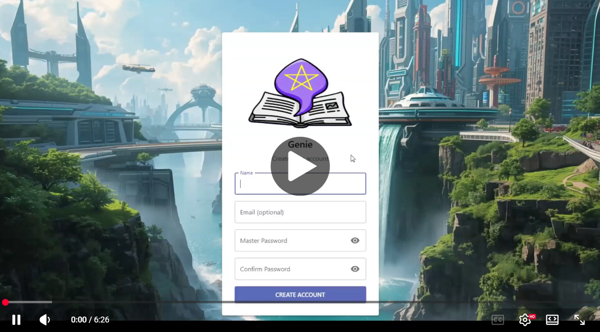
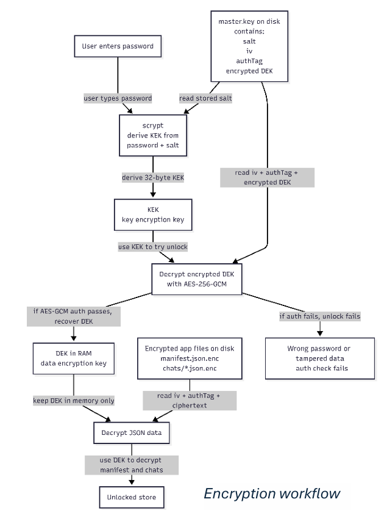
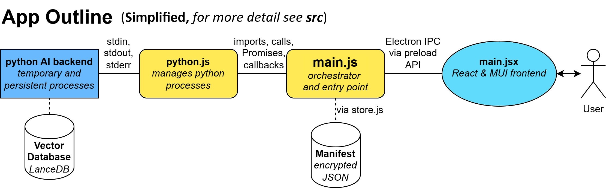

# Genie

**Genie** is a desktop Retrieval Augmented Generation (RAG) app for locally querying your documents with AI.  
Welcome to my final year project showcase!

## Demo Video

[Watch the demo on YouTube](https://www.youtube.com/watch?v=lA0Jj9-TSDw)

## Machine Learning Research

As well as building Genie, I also performed Machine Learning research to optimize the retrieval and generation pipelines and hyperparameters.
The experiments tested chunk sizes, embedding models, enrichment methods, retrieval methods, reranking, retrieval budgets, and LLM context-position effects.
[Read Machine Learning Research Summary](ml_notes.md)

## App Screenshots

<table border="0">
  <tr>
    <td width="50%"></td>
    <td width="50%"></td>
  </tr>
  <tr>
    <td width="50%"></td>
    <td width="50%"></td>
  </tr>
  <tr>
    <td width="50%"></td>
    <td width="50%"></td>
  </tr>
  <tr>
    <td width="50%"></td>
    <td width="50%"></td>
  </tr>
  <tr>
    <td ></td>
    <td width="50%"></td>
  </tr>
</table>

## Features
- **Chat** with local LLM using Retrieval Augmented Generation (**RAG**)
- Upload and index **documents**
- **Search** documents using semantic, keyword (BM25), or hybrid retrieval
- View retrieved source **chunks** for transparency
- Configure retrieval and inference **settings**, including:
  - LLM model (`.gguf`)
  - context window
  - temperature
  - retrieval method
  - number of retrieved chunks
  - chunk size
  - reranking options
- Customize interface
  - light and dark mode
  - font size
  - background image

## Technical summary

**Genie** is a **local-first RAG desktop app**. Uploaded documents are split into chunks, embedded with **MiniLM/SBERT**, and stored in **LanceDB**. At query time, relevant chunks are retrieved using **semantic, keyword (BM25), or hybrid** search, optionally **reranked** with an **MS MARCO MiniLM cross-encode**r, and passed to a local **GGUF language model** through **llama.cpp** / llama-cpp-python.

Document ingestion, retrieval, reranking, and answer generation all run on the user's machine.

## Tech Stack

**Frontend**
- Electron
- React
- Material UI
- Vite

**Backend/AI**
- llama.cpp/llama-cpp-python
- sentence-transformers/SBERT
- MiniLM Embeddings
- LanceDB (vector database)

**Languages**
- JavaScript
- Python

## Motivation

There are two main **reasons** to run RAG and LLM chat _locally_: **confidentiality/compliance**, and **offline or air-gapped environments**.

Many industries handle sensitive documents that cannot simply be sent to external cloud APIs. This includes **legal work**, where documents may be protected by legal professional privilege, and **healthcare**, where patient information is subject to strict **confidentiality** requirements.

Other sectors, such as **defence**, **advanced engineering**, and critical infrastructure, may also use **offline or air-gapped networks**. In those environments, teams still need to search and query large document collections, but the system must run locally without relying on an external AI service.

[Read Machine Learning Research Summary](ml_notes.md)

