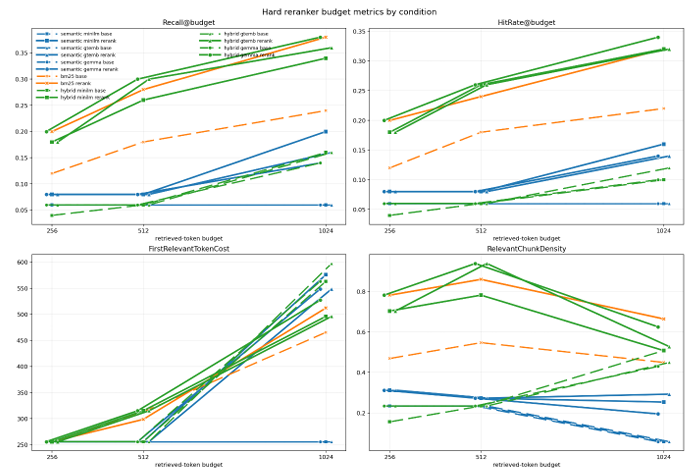

# Machine Learning Research

## Overview

## Testing pipeline diagrams
### Retrieval - effect of chunking/embedding/enrichment methods

### Generation - effect of gold chunk position

## Results

### Core Retrieval Experiments

These experiments evaluate the main retrieval pipeline: chunking, embedding, retrieval method, reranking, and retrieval budget.

| Figure | Description |
|---|---|
|  |  |
|  | |
|  | |
|  |  |
|  |  |
|  |  |
|  | |
|  | |
|  | |

### Lost-in-the-Middle / Context Position Experiments

These experiments investigate whether answer quality changes depending on where relevant retrieved chunks are placed in the model context.

| Figure | Description |
|---|---|
|  | With more chunks - the LLM gets "swamped" and accuracy decreases, mainly due to abstentions e.g. "the answer is not provided in the given context". |
|  | A modest primacy boost (the model is more accurate with the gold chunk at the start) was found, moreso than the classic U shaped lost in the middle curve. |

