# Machine Learning Research

## TLDR Conclusions

Rerankers are highly effective, more important than difference among embedders, enrichments have little effect. 2 stage bi-encoder, cross-encoder pipeline strongly validated.

Minor swamping and Primacy boost observed with respect to LLM context.

## Overview

I performed AIML research on 2 main RAG topics - retrieval and generation.

### Retrieval Experiments
For the main retrieval experiments I performed grid search over ~50 combinations of chunking, embedding, enrichment and reranking methods.

Mergers and Acquisitions contracts from the CUAD dataset (ultimately from EDGAR the SEC's online database) were used as the corpus. 

Documents were chunked at various lengths (from 64 to 1024 tokens, mainly 256 tokens) by various methods (fixed token number, semantically, and by sentence/paragraph boundaries).

The chunks were then passed to cloud LLMs (GPT-4o-mini, Gemini-Flash-2.5) for synthetic question generation (direct, indirect and informal questions that a chunk answers), as well as for summaries and atomic statements.

Various combinations of chunk content, and enrichments: description (cleaned name of contract e.g. "Siemens Distribution Agreement"), summary, atomics etc. were assembled.

These enriched chunks were then embedded by 3 embedders- MiniLM (23M parameters), GTE-ModernBERT (100M) and embeddingGemma (300M). 

The embedded chunks were then queried

### Generation Experiments
For the secondary generation experiments, I tested the effect of the number of chunks and the position of relevant/"gold" chunks in the model's context. I found that, expectedly, as you fill an LLM's context with more chunks- its accuracy decreases. Additionally, I found a primacy boost- the LLM was better able to find the relevant information from its context when the gold chunk was right at the beginning, rather than in the middle or at the end. This contrasts with the expected U-shaped lost in the middle curve.

//mention rerankers and why, attention mechanism

## Testing pipeline diagrams
### Retrieval - effect of chunking/embedding/enrichment methods
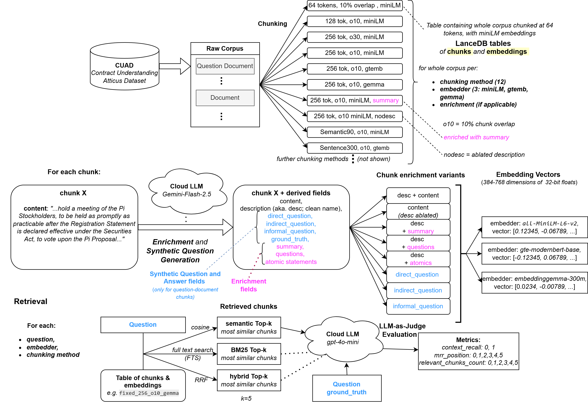
### Generation - effect of gold chunk position
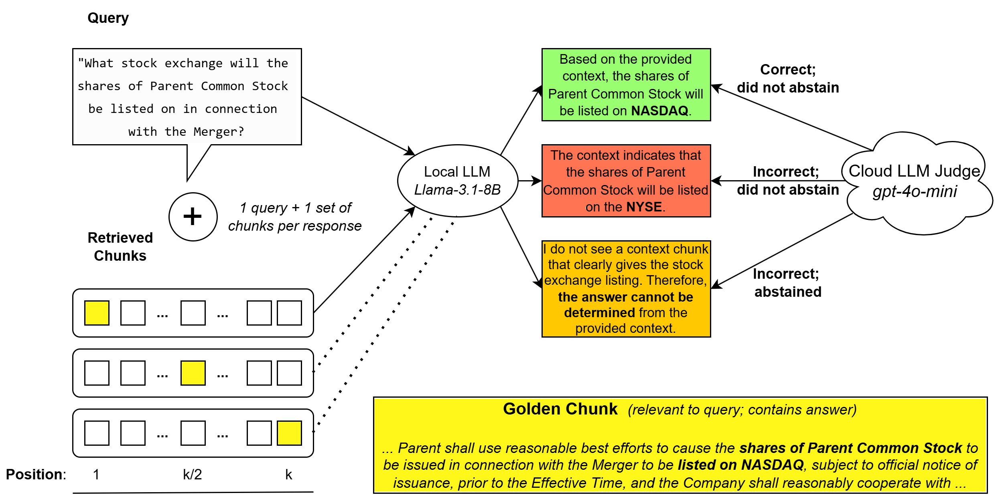
# Results

## Core Retrieval Experiments
These experiments evaluate the main retrieval pipeline: chunking, embedding, retrieval method, reranking, and retrieval budget. Each plot is followed by its explanation.

### Chunking, embedding and enrichment

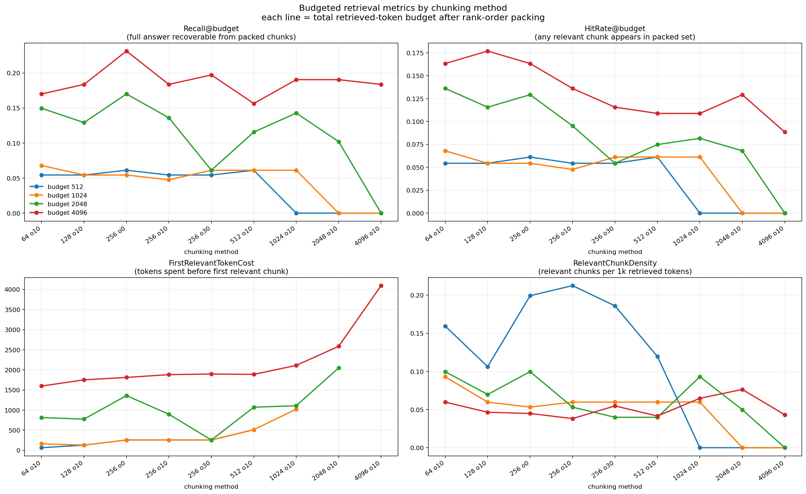

Top left plot shows that for all chunk sizes- increasing the token budget improves recall, i.e. more chunks are more likely to contain the answer.

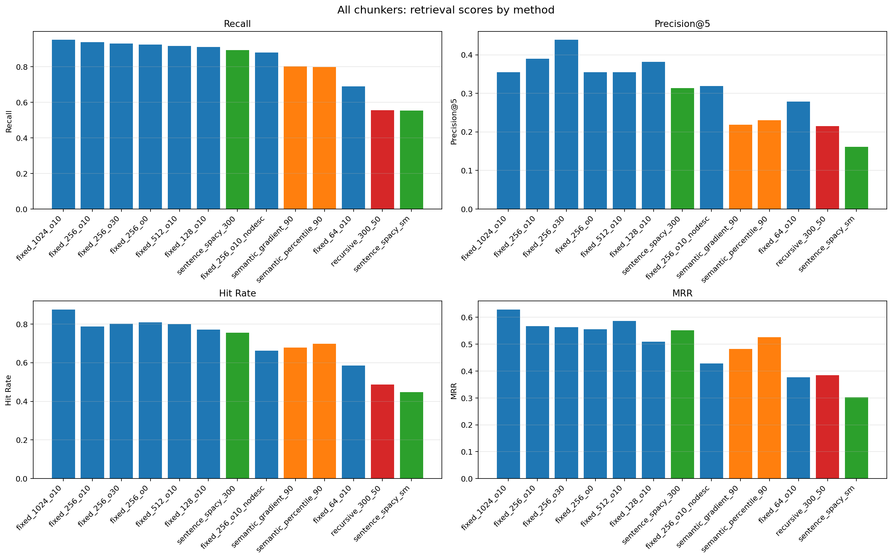

Unnormalized by chunk size, unsurprisingly the largest chunk size (1024 tokens) performs best.
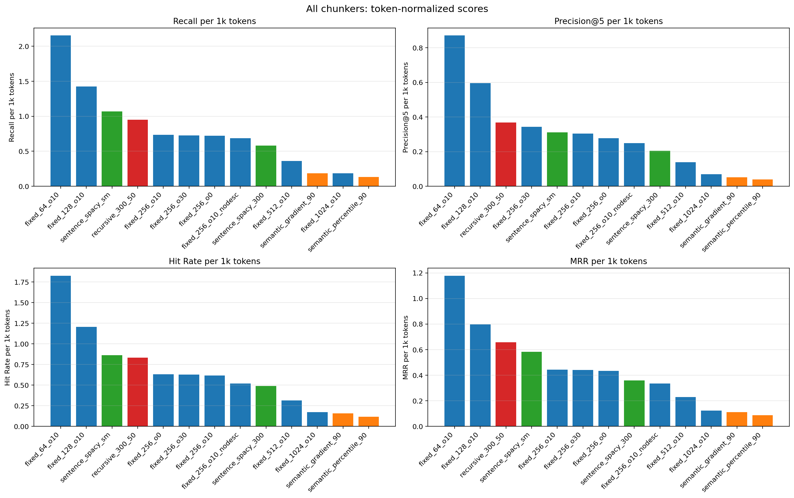
Normalized for chunk size (i.e. for the same token budget broken up by different chunking methods), the smallest chunks (64 token) do best- i.e. several small chunks have a greater chance of catching the answer, then few bigger ones.

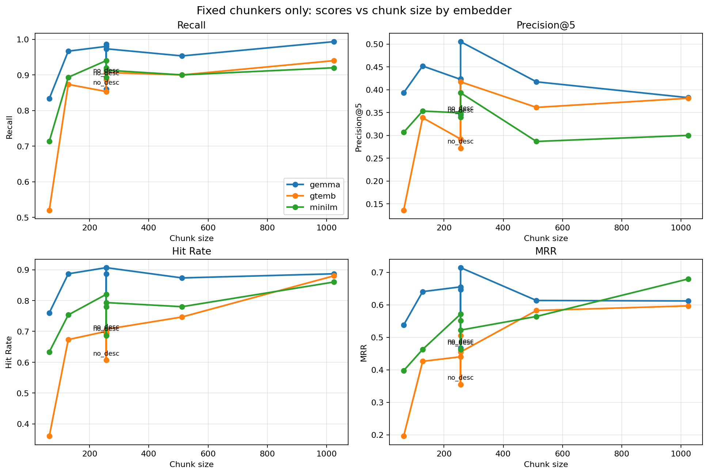

EmbeddingGemma300M was found to be the best embedder, followed by miniLM and GTE-modertBERT.

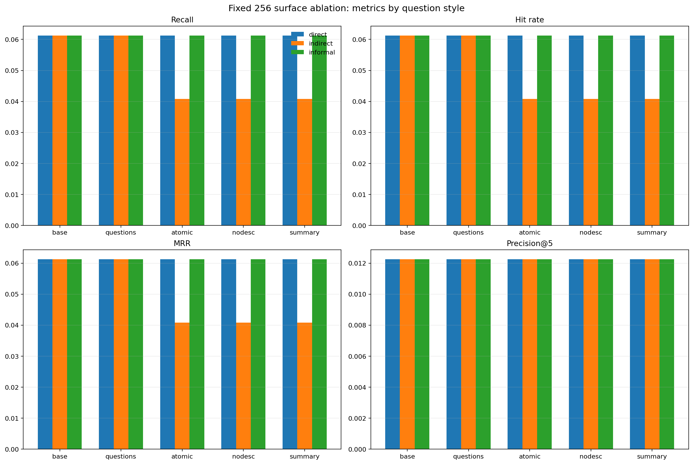

Removing the description (contains the name of the Document/Contract) or replacing the text with atomic statements, questions or summary - actually did not reduce performance much. This implies that the content of the chunk is very similar in embedding latent space to its summary, questions about it, and its atomic statement form. Also ablating (removing) the name did not actually decrease performance much so the embedder judged chunks well just via content without even knowing which contract the chunk came from.

### Reranking

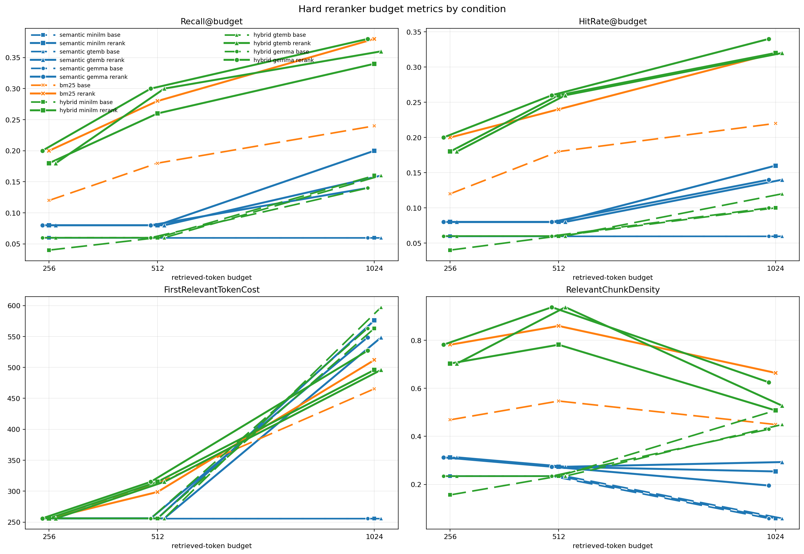
Top-left plot is most important. It shows that for both Hybrid and BM25/Keyword search, reranknig significantly improves recall. This was the most notable finding in all research performed- that rerankers are extremely powerful. Note that the least powerful embedder-  the square, miniLM (22M), with reranking (22M) is far better than all of the embedders (e.g. Gemma 300M) without reranking, both for hybrid and semantic search. 

Without reranking (thin lines) keyword > hybrid > semantic search. Though with reranking hybrid and keywords are equivalent, and optimal.

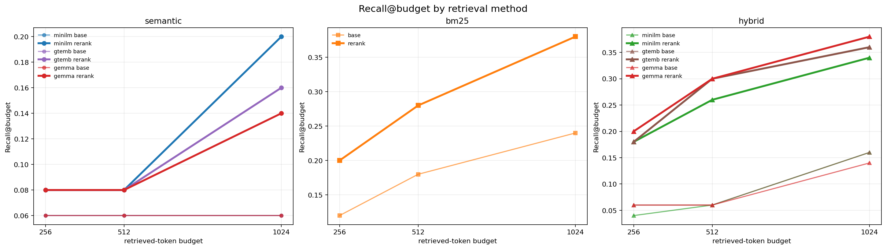

All search methods were improved by reranker but primarily keyword and hybrid, perhaps since they found the best chunks but didn't rank them to the top by default.

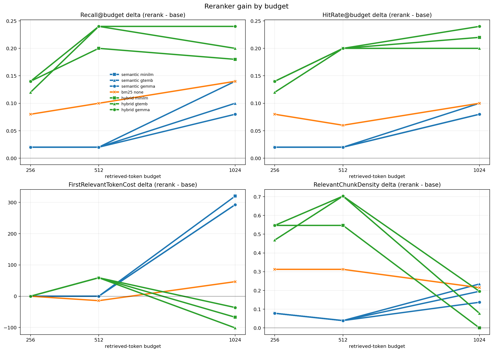

Top-left: reranking caused the highest gains for hybrid, followed by keyword search. Semantic search shows small(er) gains with reranking (in this batch of experiments at least). This suggests that hybrid had a lot of useful chunks that were not ranked correctly- that the reranker was then able to place at the top (in the top k=5).

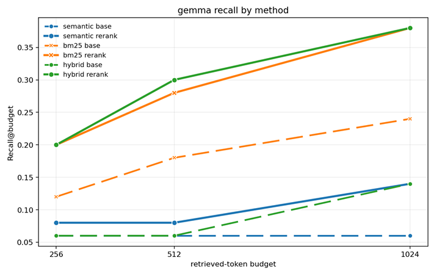

For Gemma (the best embedder, as seen in the embedding tests) reranking improves recall a lot for both hybrid and BM25 search.

## Lost-in-the-Middle / Context Position Experiments

These experiments investigate whether the accuracy of the LLM's answer changes depending on where the "gold" relevant chunk is placed in its context. (_see earlier diagram for pipeline_)
 
| Plot | Description |
|---|---|
| 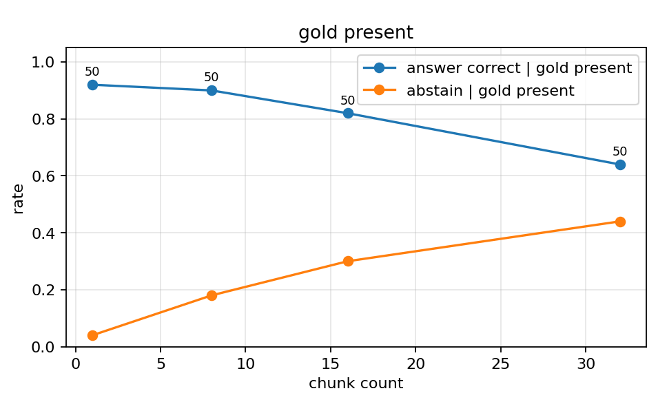 | With more chunks - the LLM gets "swamped" and accuracy decreases, mainly due to abstentions e.g. "the answer is not provided in the given context". |
| 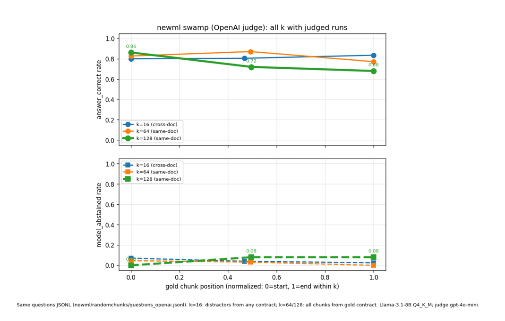 | A modest primacy boost was found, moreso than the classic U shaped lost-in-the middle-curve. (i.e. The model is more accurate with the gold chunk at the start) |

## References

[CUAD Main Page](https://www.atticusprojectai.org/cuad) | [The Atticus Project huggingface_dataset](https://huggingface.co/datasets/theatticusproject/cuad) [[2103.06268] CUAD: An Expert-Annotated NLP Dataset for Legal Contract Review](https://arxiv.org/abs/2103.06268) Dataset.

[[2309.15217] Ragas: Automated Evaluation of Retrieval Augmented Generation](https://arxiv.org/abs/2309.15217) 
This formalizes and validates the Synthetic Question Generation and LLM-as-judge.

[[2311.09476] ARES: An Automated Evaluation Framework for Retrieval-Augmented Generation Systems](https://arxiv.org/abs/2311.09476) ARES (Automatic RAG Evaluation System)- also shows use of synthetic question generation and LLM-as-judge.

[[2307.03172] Lost in the Middle: How Language Models Use Long Contexts](https://arxiv.org/abs/2307.03172) 
This suggests that LLMs may lose accuracy when the relevant chunks are in the middle 
of the context. I found more of a “first-position boost” than the classic U-shaped lost-in
the middle curve. 

[[2005.11401] Retrieval-Augmented Generation for Knowledge-Intensive NLP Tasks](https://arxiv.org/abs/2005.11401) 
The original RAG paper. 

[[1908.10084] Sentence-BERT: Sentence Embeddings using Siamese BERT-Networks](https://arxiv.org/abs/1908.10084) 
The paper demonstrates that finding the most similar pair of sentences in a collection of 
10,000 sentences took 65 hours using a BERT Cross-encoder (because every possible 
pair had to be fed into the model). By switching to a Bi-encoder (SBERT), the time was 
reduced to about 5 seconds. However cross-encoders scored slightly (3-4 points) 
better. 

[[1905.01969] Poly-encoders: Transformer Architectures and Pre-training Strategies for Fast and Accurate Multi-sentence Scoring](https://arxiv.org/abs/1905.01969) 
The paper points out that because Bi-encoders independently encode texts, document 
embeddings can be cached, allowing for fast dot-product comparisons. In contrast, 
Cross-encoders are shown to be two orders of magnitude slower at inference time 
because caching is impossible.
The authors state that Cross-encoders "attain much higher accuracies than their 
counterparts, Bi-encoders" because they concatenate the context and candidate, 
allowing for rich, fine-grained self-attention between every word in the query and 
every word in the document.  

[[1911.03814] Scalable Zero-shot Entity Linking with Dense Entity Retrieval](https://arxiv.org/abs/1911.03814) 
Introduces a two-stage algorithm. Proves that a Bi-encoder is incredibly fast for first
stage retrieval (e.g., searching 5.9 million candidates in just 2 milliseconds using 
nearest neighbor search). However, it proves that you need the "more expensive cross
encoder" for the second stage to accurately re-rank the candidates and achieve state
of-the-art accuracy, explicitly highlighting the accuracy-speed tradeoff. This validates 
the 2-stage: retrieve via embeddings, then rerank a top-k subset approach. 

[[2306.05685] Judging LLM-as-a-Judge with MT-Bench and Chatbot Arena](https://arxiv.org/abs/2306.05685) 
This shows that strong LLM judges such as GPT-4 achieve over 80% agreement with 
human preferences, the same level of agreement as occurs between human judges. 
This therefore validates that LLM-as-judge as a scalable and accurate way to 
approximate human judgments that are otherwise expensive to obtain. 

